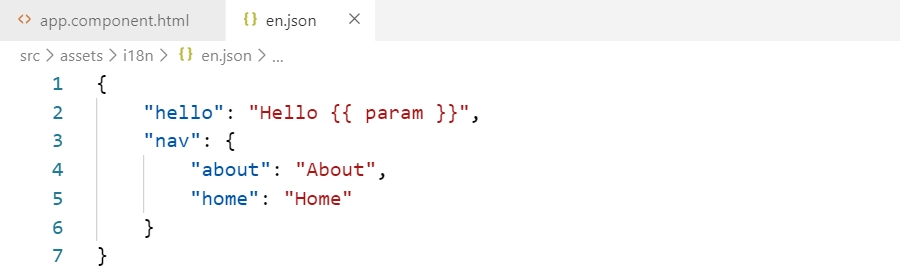

# vscode-ngx-translate-manager

[How it works (youtube.com)](https://www.youtube.com/watch?v=I0l3yrFvXfI) | [Link to Marketplace](https://marketplace.visualstudio.com/items?itemName=0x8b.ngx-translate-manager)

&nbsp;
 
 

&nbsp;
 

## Features

- automatic sort keys in the dictionary
- generated syntax depends on context
- tooltips
- intellisense completions
- fuzzy matching for searching
- easy adding and searching translations
- correctly supports ``template: ` ` `` in Angular's `@Component`

## Get started

- Install this extension from [the VSCode Marketplace](https://marketplace.visualstudio.com/items?itemName=0x8b.ngx-translate-manager) (or by entering `ext install 0x8b.ngx-translate-manager` at the command palette <kbd>Ctrl</kbd>+<kbd>P</kbd>).
- This extension is only enabled inside an Angular project (ie. with an `angular.json` or `.angular-cli.json` file in workspace).
- Open an Angular project and create `./src/assets/i18n/en.json` file.

## How to…

#### …add translation to dictionary?

- Select the text you want to add to the dictionary.
- <kbd>Ctrl</kbd>+<kbd>T</kbd>
- Enter the key in dialog box.

#### …get list of all available keys?

Type `_.` to get intellisense completions list.

#### …to search key for selected text?

- <kbd>Shift</kbd>+<kbd>Alt</kbd>+<kbd>T</kbd>
- Pick the best matching key.

## Configuration

This extension provides options in VSCode's configuration settings. You can find the settings under `File > Preferences > Settings > Extensions > ngx-translate-manager`.

Some highlights:

- `ngx-translate-manager.locale` - a glob pattern that defines files and folders to search for. The glob pattern will be matched against the paths of resulting matches relative to their workspace. By default `**/assets/i18n/en.json`.
- `ngx-translate-manager.exclude` - a glob pattern that defines files and folders to exclude. By default `**/node_modules/**`.
- `ngx-translate-manager.pattern` - a glob pattern that specify files which can use extension. By default `**/*.{html,js,ts}`.

## Issues

Feel free to submit issues and enhancement requests.

## Contributing

Please run tests `npm run test` before you submit a **Pull request**.

## License

[MIT](https://github.com/0x8b/vscode-ngx-translate-manager/blob/master/LICENSE)

