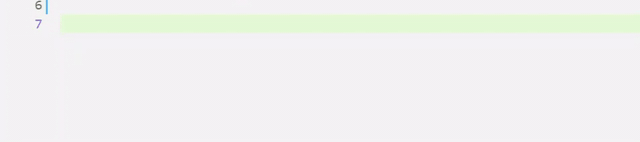

  

# [vscode-ngx-translate-manager](https://marketplace.visualstudio.com/items?itemName=0x8b.ngx-translate-manager)

## Features

- the extension automatically sort keys in a dictionary after you add new key,
- tooltips (hover key name),
- context sensitive (appropriate syntax will be generated).

## Usage

Video: https://www.youtube.com/watch?v=I0l3yrFvXfI

#### How to get list of all available keys?

- type `_.`

#### How to add translation to dictionary?

- select text
- press `Ctrl + T`
- specify key

#### How to search key for selected text?

- press `Shift + Alt + T`
- choose the best matching key

## Extension Settings

This extension contributes to the following settings:

- `ngx-translate.manager.locale`: A glob pattern that defines files and folders to search for. The glob pattern will be matched against the paths of resulting matches relative to their workspace. Default `**/locale/**/en.json`.

- `ngx-translate.manager.excludeGlobPattern`: A glob pattern that defines files and folders to exclude. The glob pattern will be matched against the file paths of resulting matches relative to their workspace. Default `**/node_modules/**`.

- `ngx-translate.manager.pattern`: A glob pattern that specify files which can use extension. Default `**/*.{html,js,ts}`.
